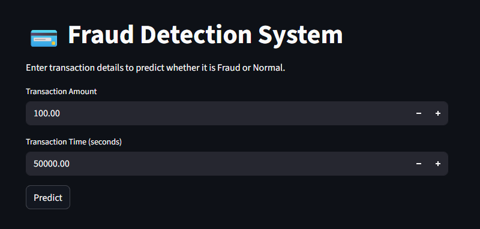

# 💳 Fraud Detection System (Machine Learning + Streamlit)


[](https://ml-fraud-detection-system.streamlit.app)

---

## 🚀 Live Deployment

🔗 **Streamlit App:**  
https://ml-fraud-detection-system.streamlit.app

> 🚀 Achieved 0.92 precision on fraud class while keeping false positives to only 6 cases.

---

## 📸 App Preview



---

## 📌 Project Overview

An end-to-end fraud detection system built using real-world credit card transaction data.

The system handles extreme class imbalance (0.16% fraud cases), compares multiple machine learning models, and deploys the final optimized model using Streamlit for interactive prediction.

This project focuses on real-world deployment balance between fraud detection and customer experience.

---

## 🚀 Features

- 🔎 Exploratory Data Analysis (EDA)
- ⚖️ Extreme class imbalance handling using SMOTE
- 🤖 Model comparison:
  - Logistic Regression
  - Random Forest
  - XGBoost
- 🎯 Threshold tuning for precision–recall tradeoff
- 💰 Financial impact analysis
- 🌐 Interactive web app (Streamlit)
- 📦 Model serialization using Joblib
- ☁️ Public cloud deployment (Streamlit Cloud)

---

## 🧠 System Architecture

### 1️⃣ Data Processing
- Removed duplicates
- Scaled `Amount` and `Time` using StandardScaler
- PCA features (V1–V28) used directly
- Stratified train-test split

### 2️⃣ Imbalance Handling
- Fraud ratio ≈ 0.16%
- Applied SMOTE only on training data to avoid data leakage

### 3️⃣ Model Training
Compared:
- Logistic Regression
- Random Forest
- XGBoost

### 4️⃣ Final Model Selection

Random Forest was selected due to:

- Very high precision (0.92)
- Extremely low false positives (6 only)
- Strong recall (0.77)
- Best balance for real-world deployment

---

## 📊 Final Model Performance (Random Forest)

- **Precision (Fraud):** 0.92  
- **Recall (Fraud):** 0.77  
- **False Positives:** 6  
- **ROC-AUC:** ~0.88  

---

## 💰 Business Impact

- ~$8,900 fraud prevented (test set simulation)
- Minimal customer inconvenience
- Operationally efficient model
- Production-ready fraud detection balance

Unlike academic approaches focused only on recall, this system prioritizes precision to reduce false fraud alerts and improve customer trust.

---

## 🏗️ Project Structure

```text
fraud-detection-system/
│
├── app.py                     # Streamlit web application
├── predict.py                 # Standalone prediction script
├── fraud_detection_model.pkl  # Trained Random Forest model
├── amount_scaler.pkl          # Scaler for transaction amount
├── time_scaler.pkl            # Scaler for transaction time
├── FRAUD DETECTION SYSTEM.ipynb
├── requirements.txt
└── README.md
```

---

## ▶️ How to Run Locally

### 1️⃣ Clone Repository

```bash
git clone https://github.com/nandithburla/fraud-detection-system.git
cd fraud-detection-system
```

### 2️⃣ Install Dependencies

```bash
pip install -r requirements.txt
```

### 3️⃣ Run Streamlit App

```bash
streamlit run app.py
```

Then open:

👉 http://localhost:8501

---

## 🔍 Prediction Logic

The model expects input features:

```
[Amount, Time, V1, V2, ..., V28]
```

- `Amount` and `Time` are scaled using saved scalers
- PCA components are used as provided
- Final processed input passed to Random Forest classifier
- Outputs prediction label and fraud probability

---

## 🚧 Future Improvements

- SHAP model explainability
- REST API version using FastAPI
- Real-time fraud scoring simulation
- Model monitoring pipeline
- Docker containerization

---

## 👤 Author

**Nandu**  
GitHub: https://github.com/nandithburla
